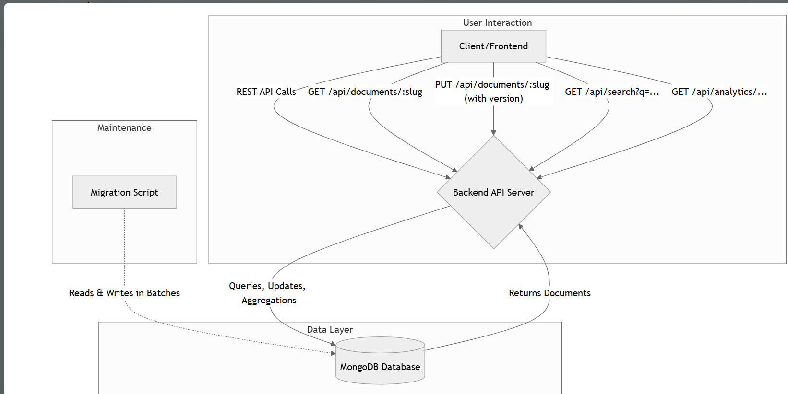

# Collaborative Document Store

A production-style collaborative document management backend built using Node.js, Express.js, MongoDB, Mongoose, and Docker.

This project demonstrates advanced backend engineering concepts including:

* RESTful API Design
* Optimistic Concurrency Control (OCC)
* MongoDB Aggregation Pipelines
* Full-Text Search
* Schema Migration Strategies
* Batch Processing
* Dockerized Infrastructure
* Modular Scalable Architecture

---

# Architecture Overview



### Main Components

### Client / Frontend

Interacts with the backend through REST APIs.

### Backend API Server

Handles:

* CRUD operations
* OCC update handling
* Search queries
* Analytics pipelines
* Schema migration logic

### MongoDB Database

Stores:

* documents
* revision history
* metadata
* tags

Supports:

* text indexes
* aggregation pipelines
* atomic updates

### Migration Script

Runs independently to migrate legacy schema documents safely in batches using MongoDB bulkWrite operations.

---

# Tech Stack

| Technology     | Purpose                       |
| -------------- | ----------------------------- |
| Node.js        | Backend Runtime               |
| Express.js     | REST API Framework            |
| MongoDB        | NoSQL Database                |
| Mongoose       | ODM                           |
| Docker         | Containerization              |
| Docker Compose | Multi-container Orchestration |
| Faker.js       | Seed Data Generation          |
| Slugify        | URL-friendly Slugs            |

---

# Features

## Core Document APIs

* Create document
* Retrieve document
* Update document
* Delete document

---

## Optimistic Concurrency Control (OCC)

Prevents concurrent users from overwriting each other's changes

### How OCC Works

* Every document contains a `version` field.
* Clients must send the latest version while updating.
* MongoDB atomically validates:

  * slug
  * version
* If versions mismatch:

  * API returns `409 Conflict`
  * Latest document is returned

This prevents the "Lost Update Problem".

---

## Full-Text Search

MongoDB text indexes power advanced search capabilities.

### Features

* Keyword search
* Relevance scoring
* Tag filtering
* Pagination
* Sorted results using `textScore`

Example:

```http
GET /api/search?q=mongodb&tags=backend,guide
```

---

## Analytics

### Most Edited Documents

```http
GET /api/analytics/most-edited
```

Finds documents with highest revision counts.

---

### Tag Co-Occurrence

```http
GET /api/analytics/tag-cooccurrence
```

Finds which tags frequently appear together.

Uses MongoDB aggregation pipelines:

* `$unwind`
* `$group`
* `$project`
* `$sort`

---

## Schema Migration

Supports zero-downtime schema evolution.

### Lazy Migration

Legacy documents are transformed in-memory during reads.

### Background Migration

Standalone migration script upgrades old documents using:

* cursor iteration
* batching
* bulkWrite

---

# Project Structure

```txt
src/
│
├── config/
├── controllers/
├── middlewares/
├── models/
├── routes/
├── services/
├── utils/
├── seed/
│
scripts/
│   └── migrate_author_schema.js
│
docker-compose.yml
server.js
.env.example
```

---

# Environment Variables

Create a `.env` file in the project root.

Example:

```env
PORT=5000
MONGO_URI=mongodb://mongo:27017/collab_docs
DATABASE_NAME=collab_docs
MIGRATION_BATCH_SIZE=1000
```

---

# Docker Setup

## Build and Run the Project

```bash
docker compose up --build
```

This will:

* start MongoDB container
* start backend container
* connect backend to MongoDB
* automatically seed the database
* expose APIs on port 5000

---

# MongoDB Compass Connection

Use:

```txt
mongodb://127.0.0.1:27018/collab_docs?directConnection=true
```

---

# Seed Data

On first startup:

* 1000 fake documents are generated
* text indexes are created
* unique slug indexes are created
* legacy schema documents are inserted intentionally

---

# API Endpoints

## Create Document

```http
POST /api/documents
```

---

## Get Document

```http
GET /api/documents/:slug
```

---

## Update Document (OCC)

```http
PUT /api/documents/:slug
```

---

## Delete Document

```http
DELETE /api/documents/:slug
```

---

## Search Documents

```http
GET /api/search?q=mongodb
```

---

## Search With Tags

```http
GET /api/search?q=mongodb&tags=backend,guide
```

---

## Most Edited Analytics

```http
GET /api/analytics/most-edited
```

---

## Tag Co-Occurrence Analytics

```http
GET /api/analytics/tag-cooccurrence
```

---


# Running the Migration Script

## Dry Run

```bash
docker compose exec backend npm run migrate:author -- --dry-run
```

Simulates migration without modifying database.

---

## Execute Migration

```bash
docker compose exec backend npm run migrate:author
```

This script:

* finds legacy documents
* processes them in batches
* converts old author schema
* uses MongoDB bulkWrite for efficiency

---

# Optimistic Concurrency Conflict Example

## User A

Fetches document version `5`

## User B

Fetches document version `5`

## User A

Updates successfully → version becomes `6`

## User B

Attempts update using version `5`

### Result

API returns:

```http
409 Conflict
```

with latest document state.

---

# Verification Checklist

## Database

* MongoDB container runs successfully
* documents collection exists
* 1000+ documents seeded
* text indexes exist
* unique slug index exists

## APIs

* CRUD endpoints working
* OCC conflict handling working
* search working
* analytics working
* migration working

---


# Author
Ashasri Suravarapu
